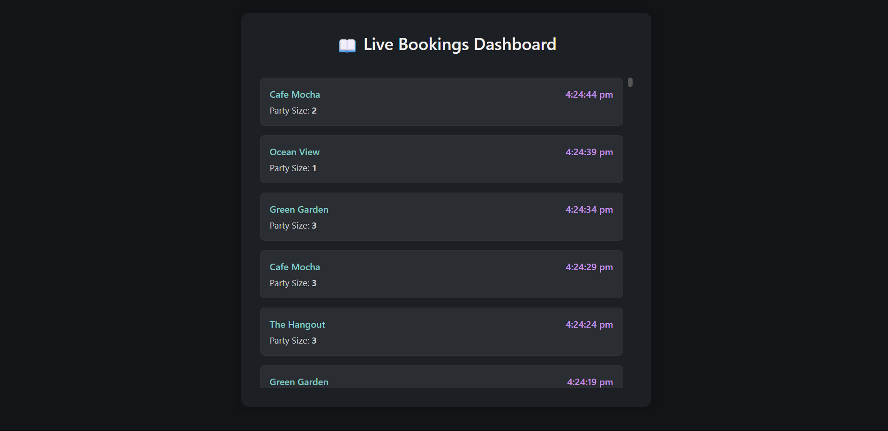

# 📖 Live Bookings Viewer

A real-time full-stack web application that displays incoming venue bookings live on a dashboard using **Node.js**, **Express.js**, **Socket.IO**, and **HTML/CSS/JavaScript**.

> Built to simulate real-world admin dashboards for managing venue bookings.

---

## 🚀 Features

- 📡 Real-time updates using **WebSockets (Socket.IO)**
- 🧪 Mock booking data generated every 5 seconds
- 🔄 Live dashboard with no page refresh


---

## 🧱 Tech Stack

| Layer    | Tech                            |
|----------|---------------------------------|
| Backend  | Node.js, Express.js, Socket.IO  |
| Frontend | HTML, CSS (vanilla), JavaScript |
| Storage  | In-memory array (ephemeral)     |

---

## 📸 Screenshot



---
## 📁 Project Structure (Split Frontend & Backend)

```
live-bookings/
├── backend/
│   ├── index.js        
│   ├── package.json
│   
│
└── live-bookings-frontend/
    |── public
    ├── index.html          
    ├── styles.css          
    ├── bs-config.json      # lite-server config
    ├── package.json
```

---

## ⚙️ Installation & Setup (Local - Separate Frontend & Backend)

### 1. Backend (Port `5000`)

```bash
cd live-bookings-backend
npm install
node index.js
```

Your backend will start at: `http://localhost:5000`

> Make sure CORS is enabled and Socket.IO server is configured with:
```js
const io = new Server(server, {
  cors: {
    origin: "http://localhost:3000",
    methods: ["GET", "POST"]
  }
});
```

---

### 2. Frontend (Port `3000`)

```bash
cd live-bookings-frontend
npm install
npm start
```

This will launch the frontend using `lite-server` at:  
`http://localhost:3000`

> Be sure the `index.html` connects to the backend like this:

```js
const socket = io("http://localhost:5000");
```

---

## 📌 Booking Format

Each mock booking object looks like this:

```json
{
  "venueName": "Cafe Mocha",
  "partySize": 3,
  "time": "10:24:52 AM"
}
```


##  Acknowledgements

- Socket.IO documentation for WebSocket implementation
- Lite-server for simple local static frontend hosting
- Built as part of a full-stack developer technical assessment
